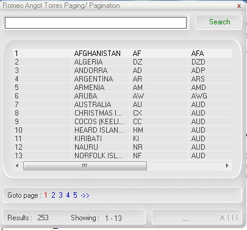



## PAGING/PAGINATION  for Visual Basic

### Description

share idea
 
### More Info
 

             |
---                |---
**Submitted On**   |2011-03-08 14:15:54
**By**             |[Romeo A\. Torres](https://github.com/Planet-Source-Code/PSCIndex/blob/master/ByAuthor/romeo-a-torres.md)
**Level**          |Intermediate
**User Rating**    |5.0 (10 globes from 2 users)
**Compatibility**  |VB 6\.0
**Category**       |[Complete Applications](https://github.com/Planet-Source-Code/PSCIndex/blob/master/ByCategory/complete-applications__1-27.md)
**World**          |[Visual Basic](https://github.com/Planet-Source-Code/PSCIndex/blob/master/ByWorld/visual-basic.md)
**Archive File**   |[PAGING\_PAG2199693132011\.zip](https://github.com/Planet-Source-Code/romeo-a-torres-paging-pagination-for-visual-basic__1-73794/archive/master.zip)

